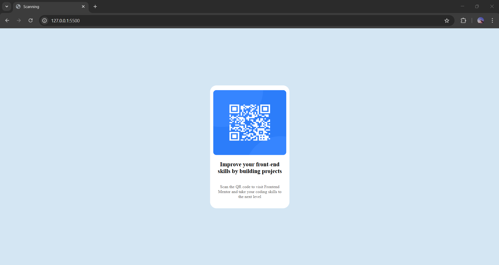

# QR Code Project

A simple static QR Code display page using only HTML and CSS.

## Features
- Displays a static QR code.
- Responsive and clean design.
- No JavaScript required.

## Technologies Used
- HTML
- CSS

## How to Use
1. Open the `index.html` file in a browser.
2. Scan the QR code to access the linked content.



## Installation
1. Clone the repository:
   ```sh
   git clone https://github.com/your-username/qr-code-project.git
